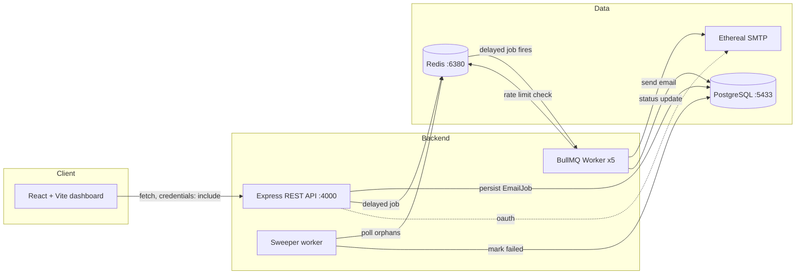
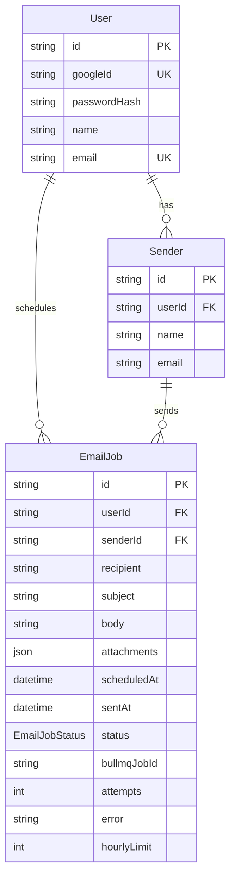
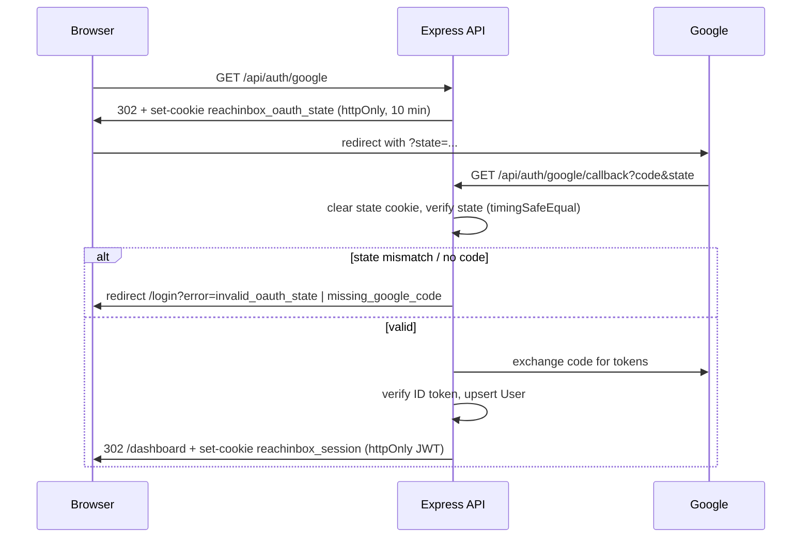
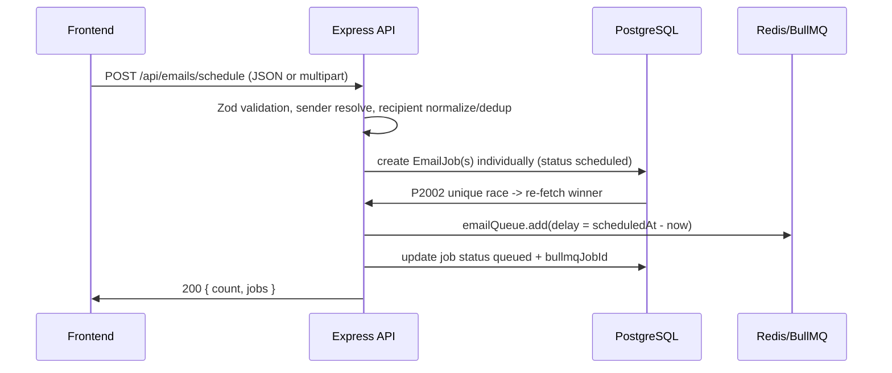
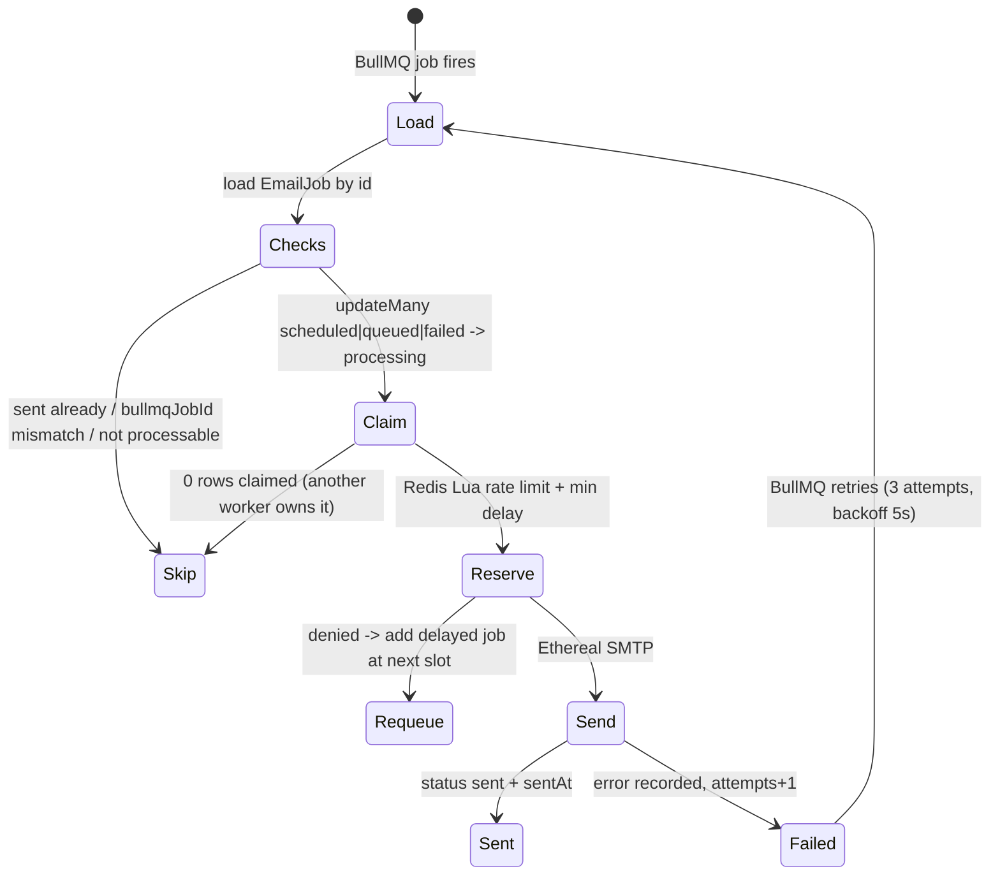
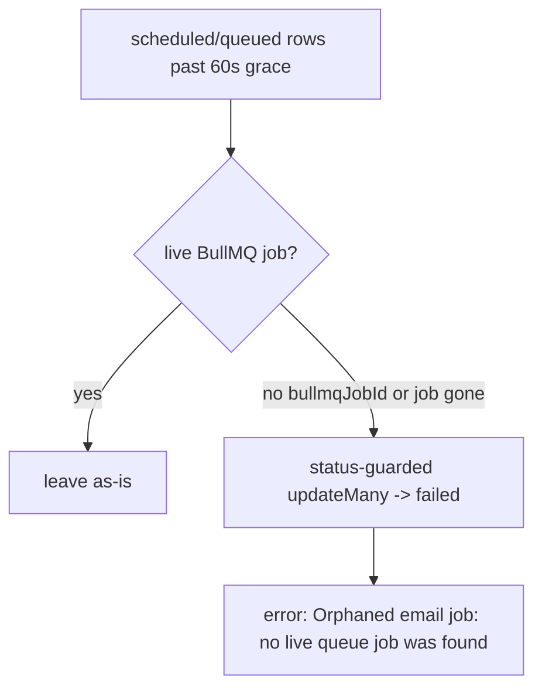

# ReachInbox Email Scheduler — Architecture

Technical deep-dive into how the system is designed and why. For setup and usage, see the root `README.md`.

---

## 1. System Overview

The application is a full-stack cold-email scheduler. A React dashboard lets a user log in (Google OAuth or email/password), upload a lead list (CSV/TXT), compose an email, and schedule it for a future time. The backend persists every email as an `EmailJob` row in PostgreSQL, enqueues a durable BullMQ delayed job in Redis, throttles sends with an atomic Redis rate limiter, and delivers through Ethereal SMTP. A separate sweeper process reconciles any job that loses its queue entry, so nothing is silently forgotten.

**Principle:** PostgreSQL is the source of truth; Redis holds time-sensitive queue state and shared rate-limit counters. The two are reconciled by the sweeper.

---

## 2. Components

| Component | Location | Responsibility |
|---|---|---|
| Express API | `backend/src/server.ts`, `app.ts` | Auth, scheduling, listing endpoints |
| Auth service | `backend/src/services/auth.service.ts` | OAuth state, Google exchange, JWT, bcrypt login |
| Email service | `backend/src/services/email.service.ts` | Schedule/list/get email jobs, dedup |
| Queue | `backend/src/queues/email.queue.ts` | `email-send-queue`, deterministic job IDs |
| Worker | `backend/src/workers/email.worker.ts` → `email-worker.service.ts` | Execute sends |
| Rate limiter | `backend/src/services/rate-limit.service.ts` | Redis Lua: hourly cap + min delay |
| SMTP | `backend/src/services/smtp.service.ts` | Nodemailer send/verify |
| Sweeper | `backend/src/services/email-sweeper.service.ts` | Orphan reconciliation |
| Prisma | `backend/prisma/schema.prisma` | `User`, `Sender`, `EmailJob` |
| Frontend | `frontend/src/` | Login, dashboard, compose, scheduled/sent lists |

---

## 3. Data Model

`EmailJob.status` is an enum: `scheduled | queued | processing | sent | failed`.

The unique dedup index `[userId, senderId, recipient, subject, md5(body), scheduledAt]` (raw SQL migration `20260813120000_dedupe_email_jobs`) makes concurrent duplicate schedule requests collapse into one. `md5(body)` keeps the b-tree index within Postgres's index-row-size limit for long bodies.

---

## 4. Flow Diagrams

### 4.1 Google OAuth login (with CSRF state)

### 4.2 Scheduling an email

Recipient `n` is scheduled at `startTime + n * delayBetweenEmails` (delay is **seconds** in the API, converted to ms in the service).

### 4.3 Worker lifecycle (crash-safe)

The whole pipeline lives in **one try/catch** in `processEmailJob`. Any failure releases the row to `failed` (a processable status) so BullMQ retries re-process it. This closes the "stuck in processing" bug where a Redis hiccup after the transition would skip every retry.

### 4.4 Rate limiting (atomic Lua)

Per-sender keys in Redis:

- `email-rate:{senderId}:{hourWindow}` — capped at `MAX_EMAILS_PER_HOUR_PER_SENDER` (default 100/h).
- `email-delay:{senderId}` — minimum time between two sends (default 2000 ms).

One `EVAL` checks the hourly counter and last-send timestamp, increments the counter, and writes the next allowed time — atomic, so concurrent workers cannot overshoot. On denial the job is re-added to the queue as a delayed job (`hourly_limit` → next hour window; `minimum_delay` → next allowed slot).

### 4.5 Orphan sweeper

The sweeper is a **self-rescheduling BullMQ delayed job** (no cron), every `EMAIL_SWEEPER_INTERVAL_MS` (5 min), plus an immediate sweep on boot. The status-guarded `updateMany` guarantees it never clobbers a worker that just claimed the row mid-sweep.

### 4.6 Restart & recovery

- Future jobs live in Redis (`--appendonly yes`) and are re-picked by the worker after a restart.
- Statuses live in Postgres, so the dashboard always reflects durable state.
- Any row that lost its queue job while the system was down is healed by the sweeper on boot.

---

## 5. Concurrency Model

- **Worker concurrency:** 5 (`WORKER_CONCURRENCY`). Each job is processed by exactly one worker via the guarded `updateMany → processing` transition.
- **Atomic rate limiting:** single Lua `EVAL` per send decision.
- **Duplicate schedule race:** unique DB index + `P2002` handling instead of transactions.
- **Exactly-once caveat:** SMTP cannot offer mathematical exactly-once delivery; the system provides practical idempotency (deterministic job IDs, guarded transitions, unique index, sent-flag check).

---

## 6. Error Handling

- `HttpError` (with status) → `res.status(...)`. `ZodError` → `400` with flattened details. Anything else → `500`.
- OAuth callback redirects with `?error=missing_google_code | invalid_oauth_state | google_auth_failed`.
- Worker failures set `error` + `attempts` on the row and rethrow for BullMQ retry (attempts 3, exponential backoff 5000 ms).

---

## 7. Security

- OAuth CSRF `state` compared with `crypto.timingSafeEqual`; state cookie httpOnly + cleared on callback.
- Session cookie httpOnly, `sameSite: lax`, `secure` in production, 7-day expiry.
- bcrypt password hashing; no registration endpoint.
- Image-only attachment MIME allowlist (multer `fileFilter` + Zod enum), 10 MB cap.
- No `any` types; secrets only in git-ignored `backend/.env`.

---

## 8. Testing Strategy

All external dependencies (Redis, Prisma, BullMQ, SMTP) are mocked — the suites run with no Docker/database.

- Backend (Vitest, node env, 7 files / 73 tests): validators, rate limiter, email service, worker crash safety, sweeper, auth service + controller.
- Frontend (Vitest, jsdom, 2 files / 19 tests): lead parser, ComposePage behavior.

Run: `npm test --workspace backend` · `npm test --workspace frontend` · `npm run lint`. See `TESTING.md`.

---

## 9. Key Design Decisions & Trade-offs

| Decision | Rationale | Trade-off |
|---|---|---|
| Postgres as source of truth + Redis for queue | Durable state; restart-safe | Two systems to reconcile → sweeper |
| Single try/catch worker pipeline | No stuck `processing` jobs | Retries may re-attempt sends that partially failed |
| Unique index with `md5(body)` | Dedup concurrent requests; fits index-row limit | md5 collisions are astronomically unlikely but not provably impossible |
| Lua rate limiting | Atomic, no overshoot under concurrency | Script is Redis-version-sensitive |
| Self-rescheduling delayed job instead of cron | Assignment requires no cron | Sweep latency up to `EMAIL_SWEEPER_INTERVAL_MS` |
| Image-only attachments | Simple, safe | No PDFs/docs |
| Ethereal SMTP | Free, previewable test inbox | Not a production sender |
| Delay expressed in seconds (API) | Simple UI semantics | Must convert to ms internally |
